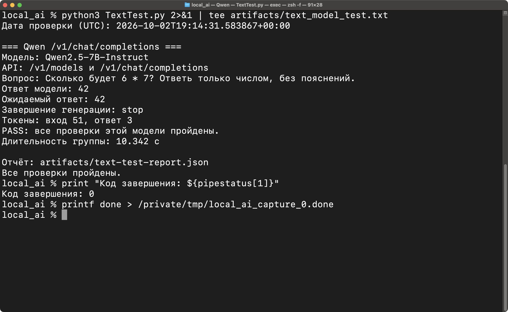
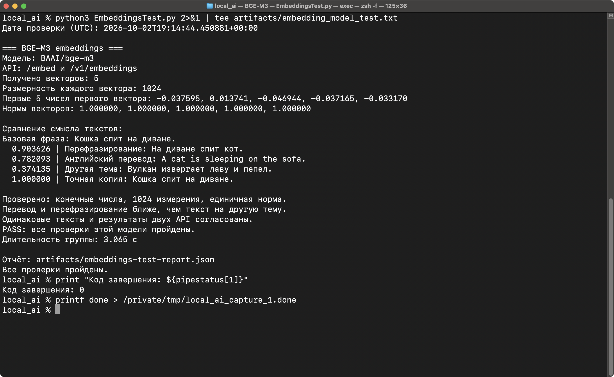
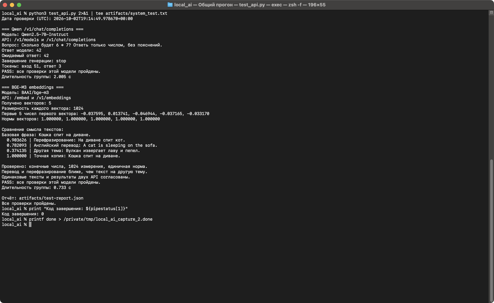
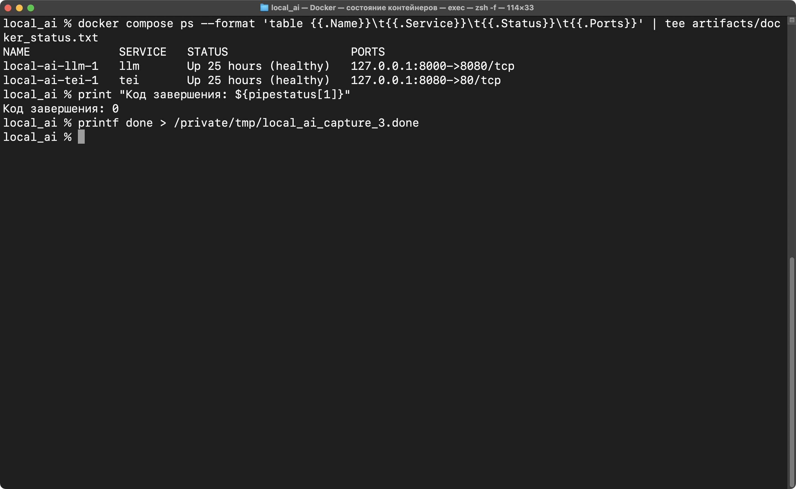
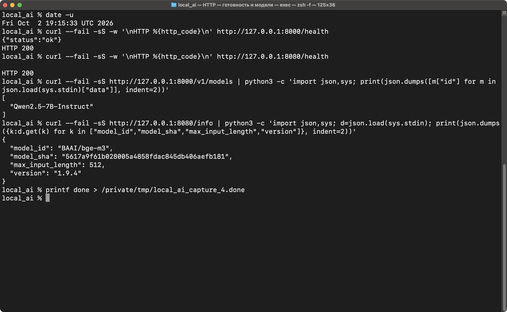

# Локальные Qwen2.5-7B-Instruct и BGE-M3 в Docker

Решение задания: LLM работает через **llama.cpp** с OpenAI-совместимым API,
эмбеддинги — через **Hugging Face Text Embeddings Inference (TEI)**.
Для каждой модели есть отдельный Python-тест с понятным выводом результатов.
Общий `test_api.py` позволяет выполнить обе проверки одной командой.

Подробная документация:

- [Схемы архитектуры и обработки запросов](docs/architecture.md).
- [Пояснительная записка: как работает каждый компонент](docs/explanatory-note.md).
- [Общая схема в SVG для просмотра и презентации](docs/architecture.svg).

| Назначение | Модель | Сервер | Адрес на компьютере |
| --- | --- | --- | --- |
| Генерация текста | Qwen/Qwen2.5-7B-Instruct-GGUF, Q4_K_M | llama.cpp | http://127.0.0.1:8000 |
| Векторизация | BAAI/bge-m3 | TEI | http://127.0.0.1:8080 |

Q4_K_M — квантизация исходной Qwen2.5-7B-Instruct, позволяющая разместить её
на компьютере с 16 ГБ RAM. BGE-M3 возвращает плотные векторы из 1024 чисел;
данный стенд не использует sparse- и ColBERT-представления.

## Требования

- Docker Desktop с Docker Compose v2, запущенный перед выполнением команд.
- Python 3.10 или новее. Внешних Python-зависимостей нет.
- По умолчанию используется ARM64-образ TEI для Mac с Apple Silicon.
- Около 10 ГБ свободного места с запасом для моделей и контейнеров.
- Доступ к Hugging Face и ghcr.io при первом запуске.

В Docker на macOS используется CPU, без Metal. Первый запуск включает загрузку
примерно 7 ГБ весов; его длительность зависит от соединения. Первый ответ LLM
также включает прогрев модели.

## Запуск и проверка

В каталоге проекта:

```bash
docker compose up -d
python3 TextTest.py
python3 EmbeddingsTest.py
```

Если контейнеры были поставлены на паузу, перед тестами выполните
`docker compose unpause`. Оба API должны перейти в состояние `healthy`.

`TextTest.py` проверяет только Qwen и работает без TEI. `EmbeddingsTest.py`
проверяет только BGE-M3 и работает без Qwen. Для обеих проверок одной командой:

```bash
python3 test_api.py
```

Скрипт ждёт готовности каждого API до 20 минут. Для медленной загрузки:

```bash
python3 test_api.py --wait 3600 --timeout 600
```

Такие же параметры `--wait`, `--timeout` и `--report` принимают отдельные тесты.

Просмотр состояния и загрузки:

```bash
docker compose ps
docker compose logs -f llm tei
```

Для готовых сервисов `docker compose ps` показывает `healthy`. `Ctrl+C` при
просмотре логов завершает только просмотр; контейнеры продолжают работать.

Тест завершается с кодом **0**, только если прошли обе группы проверок:

1. LLM: нужная модель присутствует в `/v1/models`; запрос в
   `/v1/chat/completions` возвращает сообщение assistant, правильный ответ
   `42` на `6 * 7`, штатное завершение генерации и счётчик токенов.
2. TEI: `/info` сообщает `BAAI/bge-m3`; `/embed` возвращает нужное количество
   векторов размерности 1024, без NaN/Infinity и с нормой около 1.
   Одинаковые тексты дают одинаковые векторы, а перевод на английский ближе
   к русскому предложению, чем посторонний текст. Проверяется также русское
   перефразирование «На диване спит кот.». Дополнительно проверяются
   `/v1/embeddings`, индексы и согласованность двух API.

Результат, ответы, значения сходства и длительность сохраняются в
[`artifacts/test-report.json`](artifacts/test-report.json).
Отдельные тесты записывают собственные отчёты:
[`text-test-report.json`](artifacts/text-test-report.json) и
[`embeddings-test-report.json`](artifacts/embeddings-test-report.json).
Неудачная проверка одного сервера не отменяет проверку второго.
Это функциональный smoke test, а не оценка общего качества моделей.

## Структура для сдачи задания

```text
local_ai/
├── compose.yaml                       # Два сервера и постоянные тома моделей
├── TextTest.py                        # Отдельный тест языковой модели
├── EmbeddingsTest.py                  # Отдельный тест эмбеддингов и сходства
├── api_utils.py                       # Общие HTTP-запросы, ожидание и отчёты
├── test_api.py                        # Запуск обеих проверок
├── text_model_run_commands.txt        # Команды запуска и проверки Qwen
├── embeddings_model_run_commands.txt  # Команды запуска и проверки BGE-M3
├── requirements.txt                   # Внешние библиотеки не требуются
├── text_model_test.png                # Настоящий снимок Terminal: тест Qwen
├── embedding_model_test.png           # Настоящий снимок Terminal: тест TEI
├── artifacts/                        # JSON-отчёты и текстовый вывод запусков
│   └── screenshots/                  # Снимки общего теста, Docker и HTTP API
└── docs/                             # Схемы и пояснительная записка
```

Устанавливать `requests`, `numpy` и другие библиотеки не нужно: тесты используют
стандартную библиотеку Python. `requirements.txt` содержит это пояснение.
`api_utils.py` должен находиться рядом с файлами тестов.

Результаты раздельного запуска сохранены как текст:
[Qwen](artifacts/text_model_test.txt), [BGE-M3](artifacts/embedding_model_test.txt).
Пять PNG ниже — настоящие снимки окна macOS Terminal, сделанные 2 октября
2026 года штатной утилитой `screencapture` после выполнения команд.
Разрешение каждого снимка — **2800 × 1722 пикселя**. Для отдельных тестов
увеличен шрифт; исходный PNG можно открыть по ссылке на изображении.
Содержимое снимков не дорисовывалось и не собиралось из текстовых файлов.
Оба отдельных теста и общий прогон завершились с кодом `0`.

[](text_model_test.png)

[](embedding_model_test.png)

Общий запуск `python3 test_api.py`: обе модели успешно прошли проверки.
Полный вывод: [`artifacts/system_test.txt`](artifacts/system_test.txt).

[](artifacts/screenshots/system_test.png)

Состояние Docker: оба контейнера `healthy`, показаны опубликованные порты.

[](artifacts/screenshots/docker_status.png)

Прямые HTTP-запросы: оба `/health` возвращают `200`, `/v1/models` сообщает
Qwen2.5-7B-Instruct, а `/info` — BAAI/bge-m3 и параметры TEI.
В выводе сведений о моделях выбраны только нужные поля JSON.

[](artifacts/screenshots/api_health.png)

### Результат контрольного запуска

Проверено 1 октября 2026 года на Mac ARM64 с 16 ГБ RAM и примерно 8 ГБ памяти
Docker. Обе модели запущены одновременно в двух контейнерах. После
пересоздания контейнеров веса использовались из сохранённых томов.

| Проверка | Фактический результат |
| --- | --- |
| Qwen: `6 * 7` | `42`, PASS |
| BGE-M3: размерность | 1024, PASS |
| Cosine similarity: русский текст / английский перевод | 0,782093 |
| Cosine similarity: русский текст / посторонний текст | 0,374135 |
| Cosine similarity: одинаковые тексты | 1,000000 |
| TEI `/v1/embeddings` | PASS |
| Итоговый код завершения теста | 0 |

Машиночитаемое подтверждение первого запуска:
[`artifacts/initial-test-report.json`](artifacts/initial-test-report.json).
Актуальный общий отчёт после разделения тестов находится в
[`artifacts/test-report.json`](artifacts/test-report.json).

## Примеры запросов

### Генерация текста через OpenAI-совместимый API

```bash
curl --fail-with-body http://127.0.0.1:8000/v1/chat/completions \
  -H 'Content-Type: application/json' \
  -d '{
    "model": "Qwen2.5-7B-Instruct",
    "messages": [{"role": "user", "content": "Что такое Docker? Ответь кратко."}],
    "temperature": 0.2,
    "max_tokens": 128,
    "stream": false
  }'
```

Для OpenAI-совместимого клиента `base_url` равен `http://127.0.0.1:8000/v1`.
Облачный API и ключ OpenAI не нужны.

### Эмбеддинги через TEI

```bash
curl --fail-with-body http://127.0.0.1:8080/embed \
  -H 'Content-Type: application/json' \
  -d '{"inputs": ["Привет, мир!", "Hello, world!"], "normalize": true}'
```

Альтернативный OpenAI-совместимый endpoint:

```bash
curl --fail-with-body http://127.0.0.1:8080/v1/embeddings \
  -H 'Content-Type: application/json' \
  -d '{"model": "BAAI/bge-m3", "input": ["Привет, мир!"], "encoding_format": "float"}'
```

Документация TEI после запуска: http://127.0.0.1:8080/docs.
Веб-интерфейс llama.cpp: http://127.0.0.1:8000.

## Настройки

Все значения по умолчанию находятся в `compose.yaml`. Файл `.env` необязателен.
Для изменения портов или запуска на x86_64:

```bash
cp .env.example .env
```

На Linux x86_64 или Intel Mac установите в `.env`:

```dotenv
TEI_IMAGE=ghcr.io/huggingface/text-embeddings-inference:cpu-1.9
```

Образ llama.cpp поддерживает ARM64 и x86_64. При изменении портов передайте
соответствующие адреса тесту, например:

```bash
python3 test_api.py --llm-url http://127.0.0.1:9000 --tei-url http://127.0.0.1:9001
```

Скрипт также принимает `LLM_URL` и `TEI_URL` из окружения; `.env` читает только
Docker Compose. `--help` показывает все параметры теста.

Конфигурация ограничивает контекст LLM до 2048 токенов и использует один слот
генерации. Для TEI лимит батча составляет 512 токенов, до 8 текстов в запросе.
Длинные входы по умолчанию обрезаются до 512 токенов; `"truncate": false`
в `/embed` позволяет получить ошибку вместо обрезания. Полная BGE-M3
поддерживает до 8192 токенов, но такой режим требует больше ресурсов.

Порты доступны только через `127.0.0.1`. В Docker-сети серверам соответствуют
адреса `http://llm:8080` и `http://tei:80`. Предусмотрены healthcheck,
автоматический перезапуск и ротация логов. Образы для ARM64 зафиксированы по
SHA256 digest, ревизия BGE-M3 также зафиксирована в Compose.

## Остановка и повторный запуск

```bash
docker compose down
docker compose up -d
```

Модели сохраняются в именованных томах `local-ai_llm-data` и
`local-ai_tei-data`, поэтому повторная загрузка весов не требуется.
Не добавляйте `-v` к `down`, если хотите сохранить скачанные модели.

Если сервис долго не готов, проверьте `docker compose logs --tail 100`.
Ошибка `no space left on device` означает нехватку диска. Если контейнер
завершается с `OOMKilled`, увеличьте память Docker Desktop в
Settings → Resources → Memory, например до 10 ГБ, и повторите запуск.

## Официальные источники

- [llama.cpp в Docker](https://github.com/ggml-org/llama.cpp/blob/master/docs/docker.md)
- [Qwen2.5-7B-Instruct-GGUF](https://huggingface.co/Qwen/Qwen2.5-7B-Instruct-GGUF)
- [Образы и архитектуры TEI](https://huggingface.co/docs/text-embeddings-inference/en/supported_models)
- [Параметры TEI](https://huggingface.co/docs/text-embeddings-inference/en/cli_arguments)
- [Модель BGE-M3](https://huggingface.co/BAAI/bge-m3)
