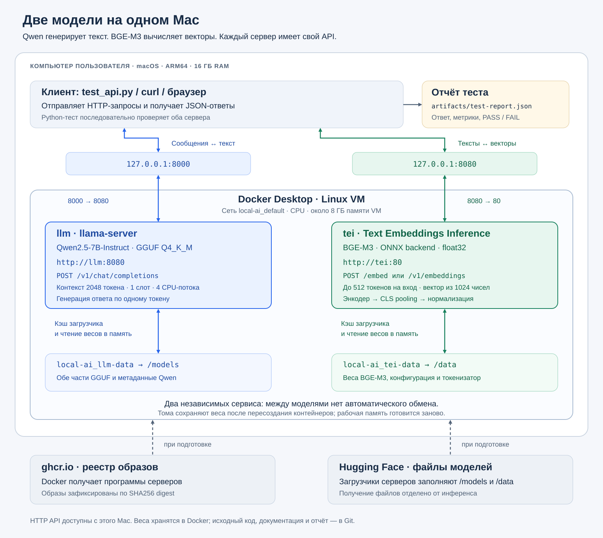
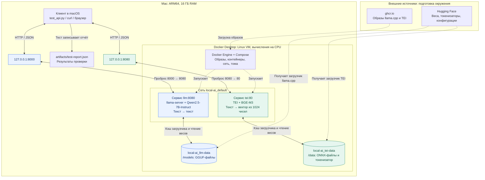
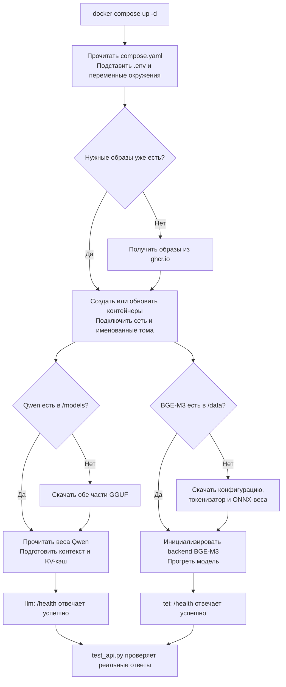
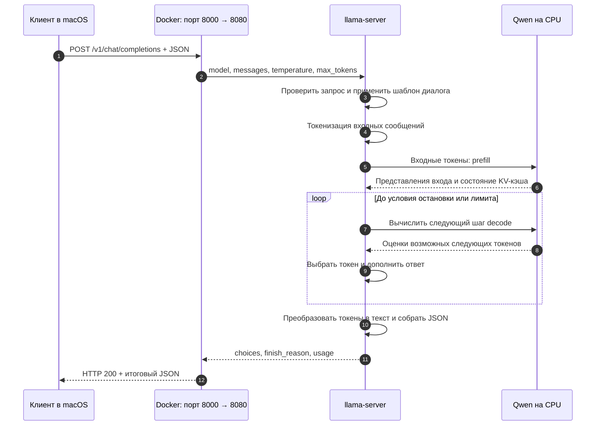
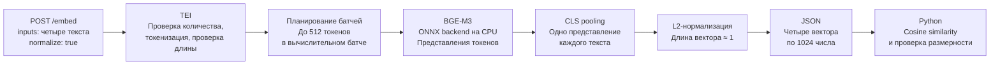
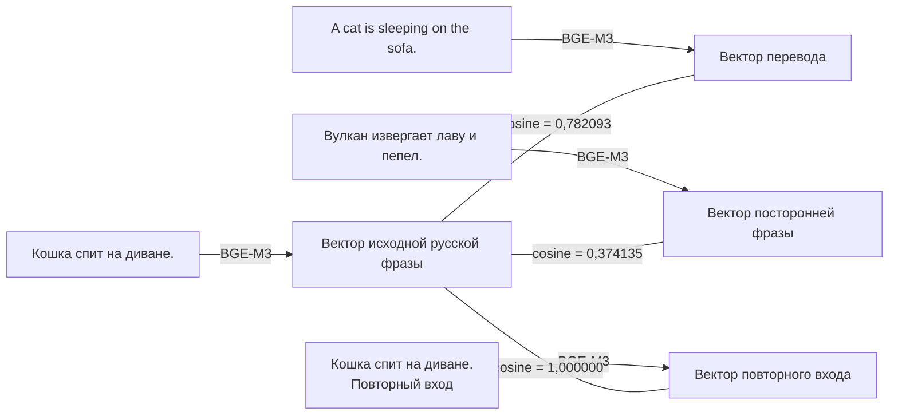
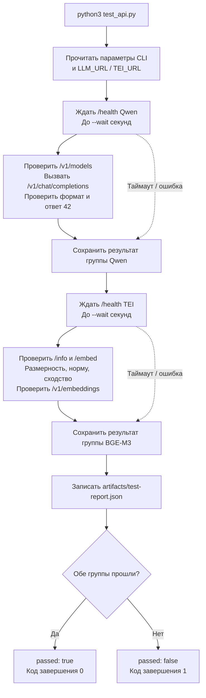
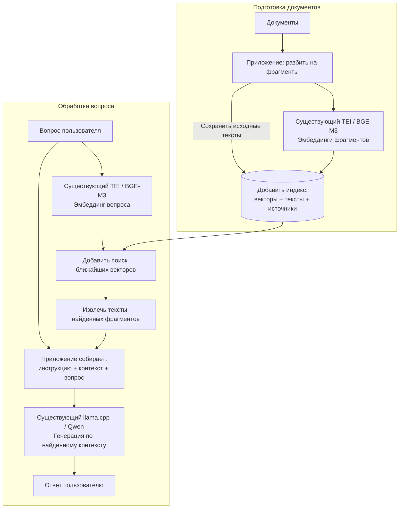

# Схемы работы локальных моделей

Схемы соответствуют [compose.yaml](../compose.yaml) и
[test_api.py](../test_api.py). Подробное объяснение терминов и настроек —
в [пояснительной записке](explanatory-note.md).

## 1. Общая схема развёртывания

[Открыть схему SVG отдельно](architecture.svg). Изображение масштабируется
без потери качества и подходит для вставки в презентацию.

Синим обозначена генерация текста, зелёным — вычисление эмбеддингов.
Стрелки HTTP показывают запрос и ответ. Пунктир обозначает получение
файлов при подготовке; этот путь не участвует в вычислении каждого ответа.

Точная схема сетевых и файловых связей:

Между `llm` и `tei` в текущем приложении нет потока данных.
Docker создаёт доступную обоим сеть, но не связывает модели автоматически.
Python-тест запускается на Mac и последовательно проверяет оба сервера.

## 2. Первый запуск и повторный запуск

Две ветви подготовки выполняются независимо. `up -d` возвращает управление
после запуска контейнеров и сам по себе не ждёт окончания скачивания весов.
Healthcheck Docker и ожидание в Python-тесте — два отдельных механизма.

При повторном запуске сохранённые веса читаются из тех же томов; RAM и
рабочие кэши процесса подготавливаются заново. Возможные сетевые проверки
метаданных на этой упрощённой схеме не показаны.

## 3. Запрос к Qwen: от вопроса до текста

В нашем тесте используются `temperature=0`, `max_tokens=16`, `stream=false`.
Получен текст `42`, `finish_reason=stop`, 51 входной и 3 выходных токена.
Модель уже загружена в сервер: клиент не передаёт веса и не загружает их
заново при каждом HTTP-запросе.

## 4. Запрос к BGE-M3: от текста до вектора

`/v1/embeddings` предоставляет ту же задачу через другой формат JSON.
Ответ содержит `data`, а у каждого элемента — `index` и `embedding`.
Тест проверяет согласованность этого endpoint с `/embed`.

Смысл контрольного сравнения:

Сходство сравнивается между векторами, а не между строками по совпадению букв.
Числа здесь — измерения из [отчёта запуска](../artifacts/test-report.json).
Косинусное сходство не является вероятностью правильности.

## 5. Как Python-тест определяет успех

Ожидаемые ошибки во время самих проверок также записываются как результат
со статусом `failed`. Даже если Qwen недоступен, скрипт проверит TEI.
Проверки выполнены последовательно, хотя серверы работают одновременно.

## 6. Возможное расширение: поиск по документам

**Это схема дальнейшего развития. Следующие компоненты не реализованы
в текущем репозитории:** разбиение документов, индекс, поиск и приложение RAG.
Существующие API Qwen и BGE-M3 можно использовать повторно.

Векторы помогают выбрать подходящие фрагменты. В `messages` модели Qwen
приложение передаёт тексты фрагментов и вопрос. Сама установка двух
контейнеров не создаёт этот процесс автоматически.

## Связь схем с файлами

| Элемент на схемах | Где он определён |
| --- | --- |
| Контейнеры, порты, сеть по умолчанию, тома, healthcheck | [compose.yaml](../compose.yaml) |
| Необязательные переопределения портов и образа TEI | [.env.example](../.env.example) |
| HTTP-запросы, валидация и сохранение результата | [test_api.py](../test_api.py) |
| Фактические ответы и значения сходства | [artifacts/test-report.json](../artifacts/test-report.json) |
| Объяснение механизмов, ограничений и параметров | [explanatory-note.md](explanatory-note.md) |
